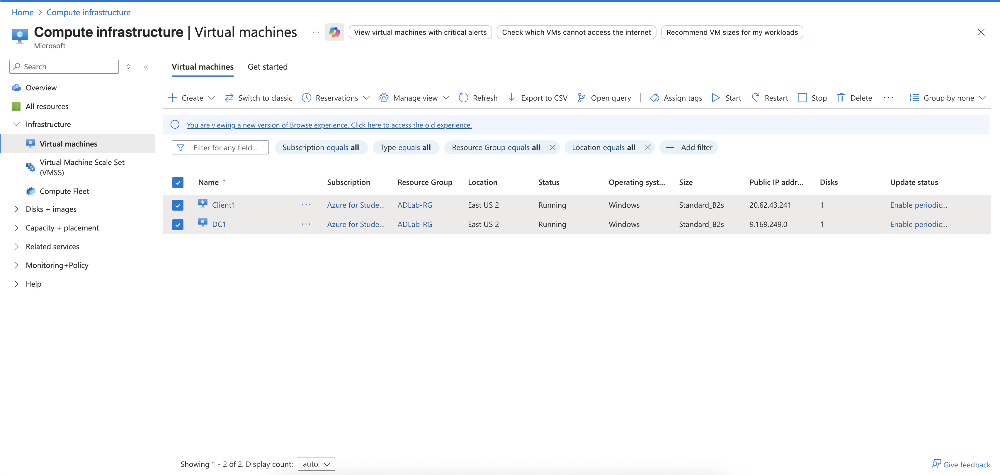
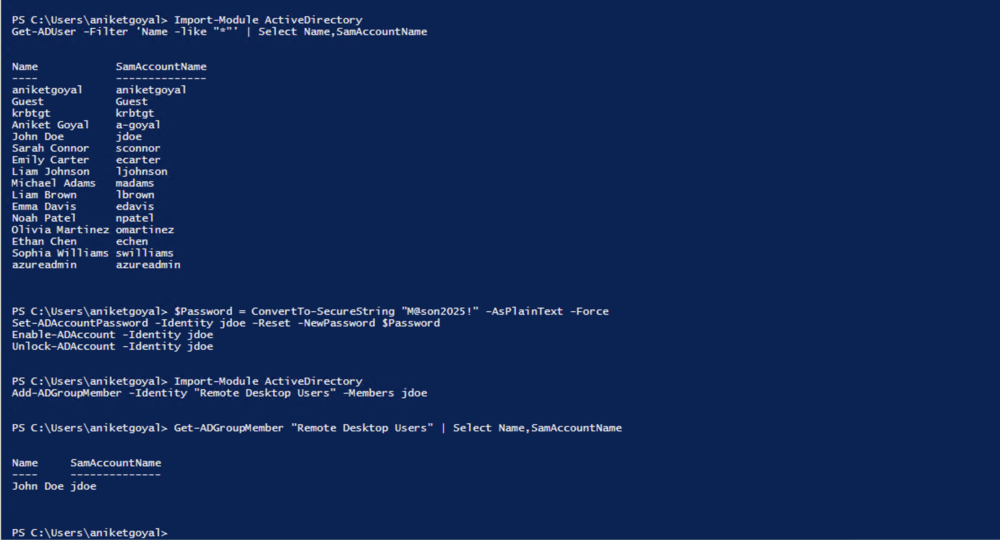
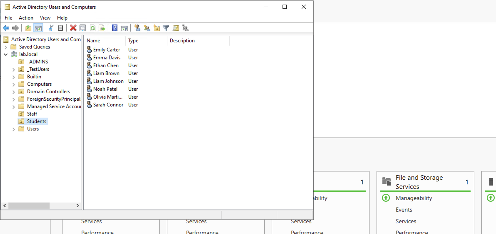
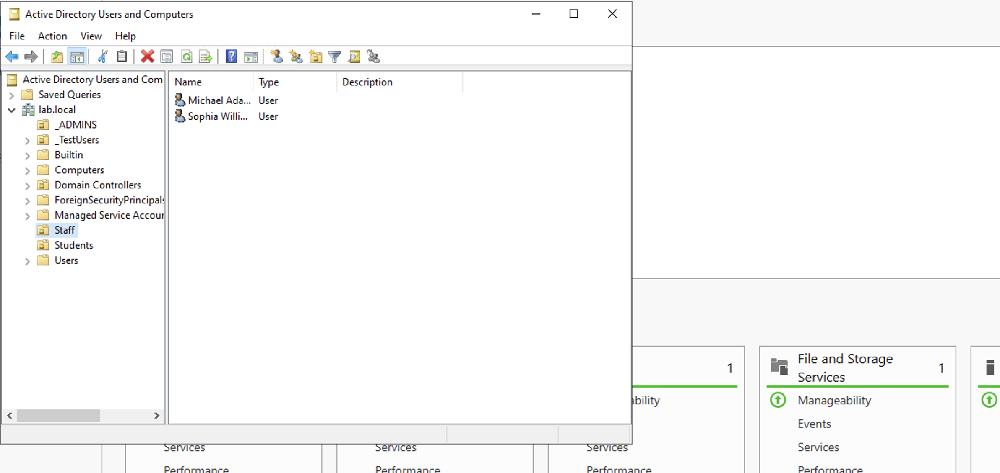
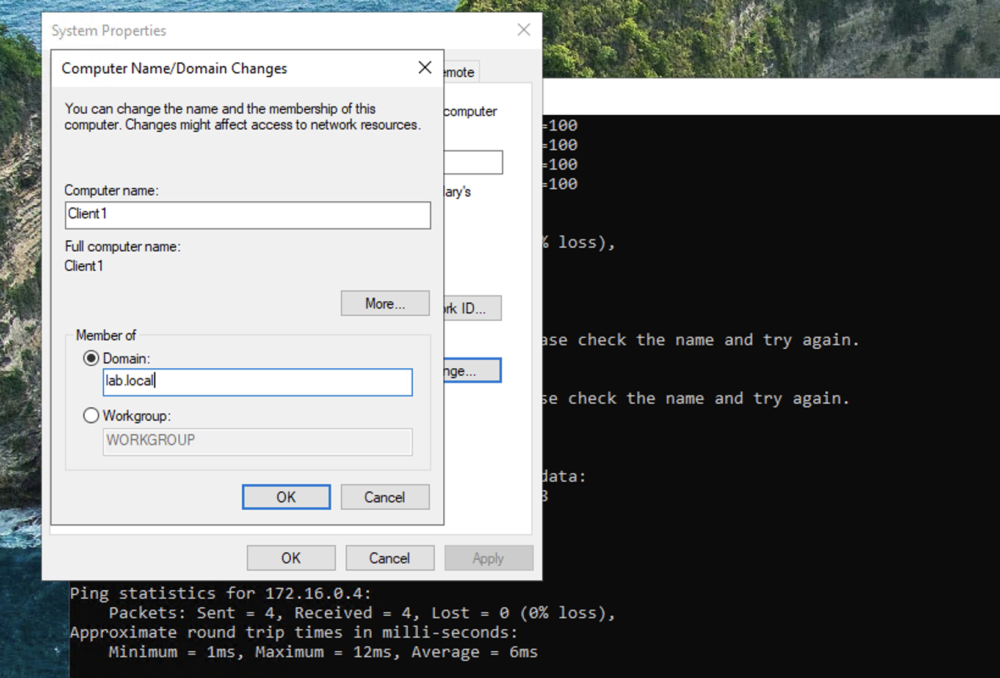
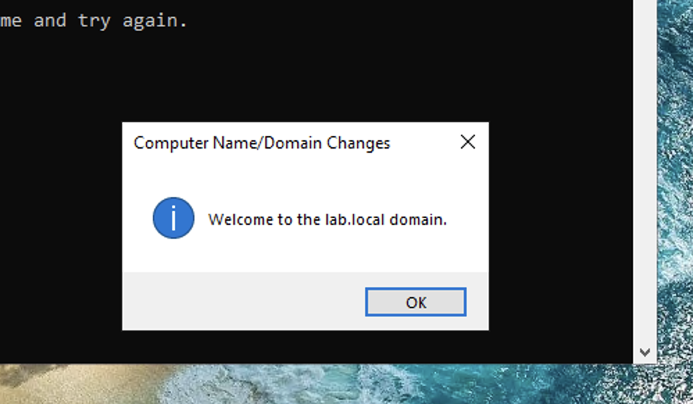
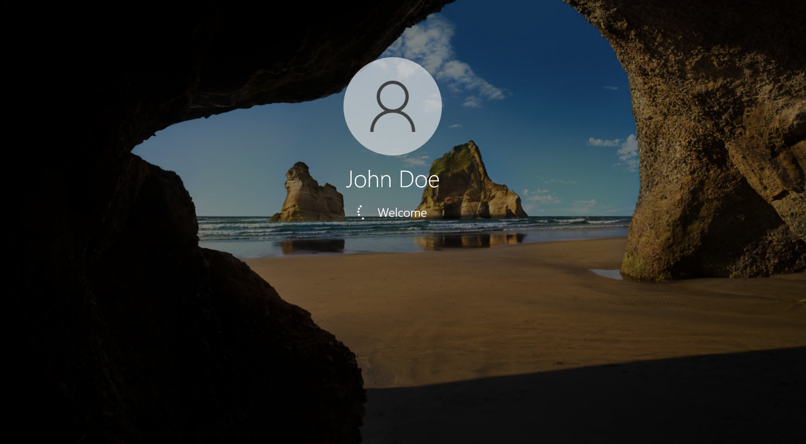
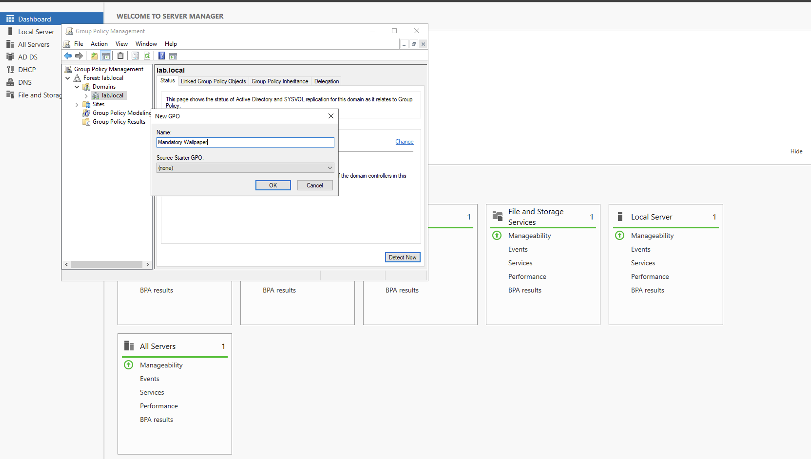

# Active Directory Homelab (Azure Virtual Environment)

## Overview
This project simulates a real-world enterprise IT environment using Microsoft Azure, Windows Server 2022 Datacenter (Azure Edition), and Windows 10 virtual machines. The lab demonstrates domain configuration, DNS and DHCP setup, user management, and Group Policy administration within a secure, cloud-hosted virtual network.

## Technologies Used
- Microsoft Azure Virtual Machines  
- Windows Server 2022 Datacenter (Azure Edition)  
- Windows 10 (Client)  
- Active Directory Domain Services (AD DS)  
- DNS and DHCP Configuration  
- Group Policy Management Console (GPMC)  
- PowerShell  

## Network Architecture
| Component | Role | IP Address | Notes |
|------------|------|-------------|--------|
| DC1 | Domain Controller, DNS, DHCP | 172.16.0.4 | lab.local domain |
| Client1 | Domain-Joined Windows 10 | 172.16.0.5 | Joined to lab.local |
| Azure VNet | Handles NAT and private subnet | 172.16.0.0/24 | Cloud-managed |

## Key Features
- Configured Active Directory domain: lab.local  
- Created OUs for Admins, Staff, and Students  
- Set up DNS and DHCP for domain name resolution and IP leasing  
- Joined a Windows 10 client to the domain  
- Applied a Group Policy Object (GPO) to enforce a mandatory wallpaper  
- Verified RDP access for all domain users  

## What I learned

Throughout this project I faced many issues which I learned to troublehoot and overcome. One key issue that I faced was that because my Mac runs on Apple Silicon, VMware was incompatible with x86 Windows Server ISOs. To overcome this, I migrated my entire Active Directory deployment to Microsoft Azure, where I configured a virtual network, attached a static private IP to the domain controller, and created a public IP for remote access. During setup, I resolved DHCP scope conflicts by redesigning the network from 10.0.0.0 to 172.16.0.0/24 and verified connectivity through DNS resolution and domain joins. These challenges strengthened my understanding of cloud networking, IP management, and domain integration—skills essential for modern IT infrastructure and systems administration.

## Screenshots

#### - Azure Portal

#### - Active Directory Users and Admins

#### - DHCP 

#### - Client1 joined to lab.local

#### - Successful RDP login as lab\jdoe 

#### - Group Policy wallpaper applied

## Outcome
This homelab successfully simulates a managed IT infrastructure where domain users and systems are controlled through centralized policies and services. The setup demonstrates core enterprise administration skills, including Active Directory, DHCP, DNS, and Group Policy management.

